# Analysis Page

此頁面呈現單次 Verilog 分析結果，包含 EDA pipeline 狀態、指標、波形、依賴圖、log 與 AI 建議。

## 操作步驟

1. 從 Upload 啟動分析，或從 History 點擊既有 run。
2. 查看 workflow pipeline，確認 parser、lint、simulation、synthesis、dependency analysis 與 AI report 的狀態。
3. 檢查 summary metrics、lint issues、waveform、dependency graph 與 log。
4. 閱讀 AI insight、risk panel 與 next actions，判斷設計是否需要修正。
5. 在技術視圖與決策視圖之間切換，依 demo 情境展示不同重點。

## 功能介紹

- 即時追蹤分析階段狀態。
- 顯示 synthesis metrics、simulation waveform 與 module dependency graph。
- 整合 lint、logic flowchart 與 log viewer。
- 提供 AI summary、risk score、bottleneck analysis 與改善建議。
- 根據分析結果產生 readiness verdict，協助快速判斷設計狀態。

## Demo 截圖順序

### 1. Pipeline 狀態

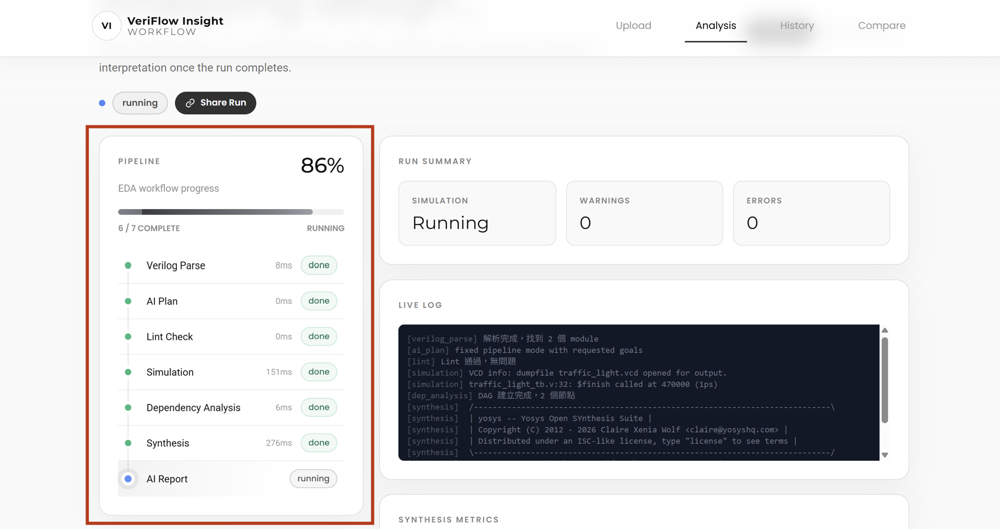

展示 EDA workflow 各階段是否完成或失敗。

### 2. Metrics 與 verdict

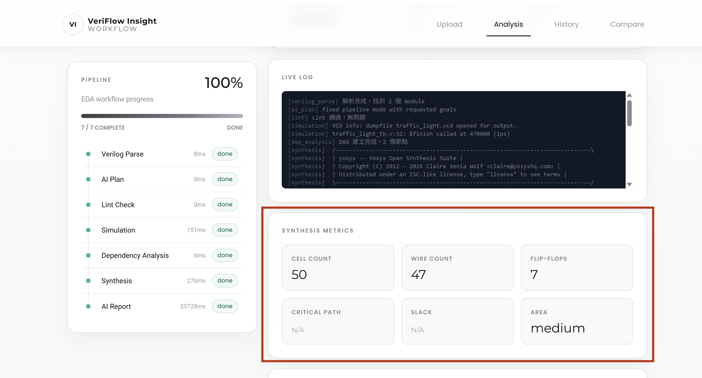

呈現 readiness、cell count、warning 與主要決策資訊。

### 3. Waveform

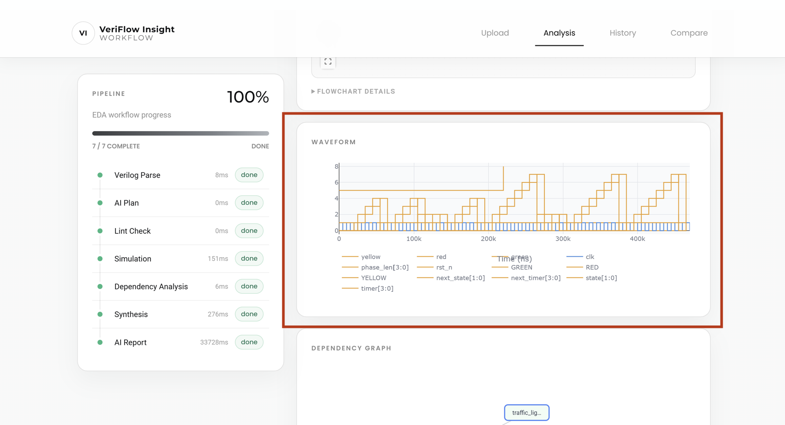

顯示 simulation 產生的 waveform，方便驗證功能行為。

### 4. Dependency graph

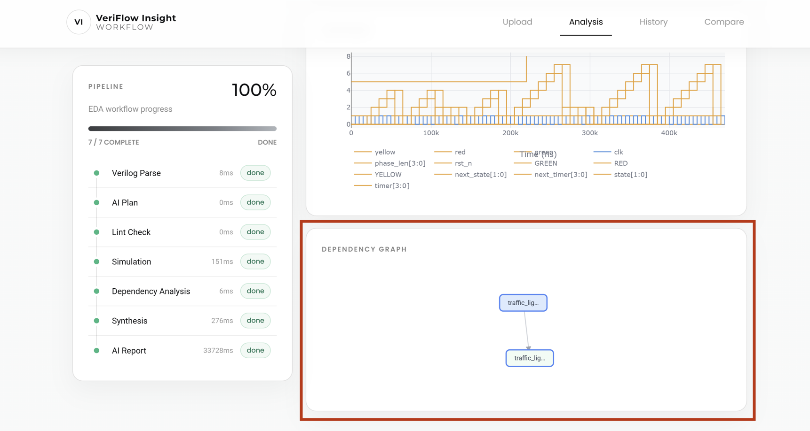

顯示 module 之間的依賴關係。

### 5. Logic Flowchart

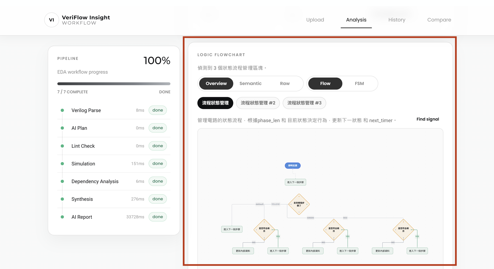

顯示設計中的主要控制流程與訊號邏輯關係，方便說明 RTL 行為。

### 6. AI insight

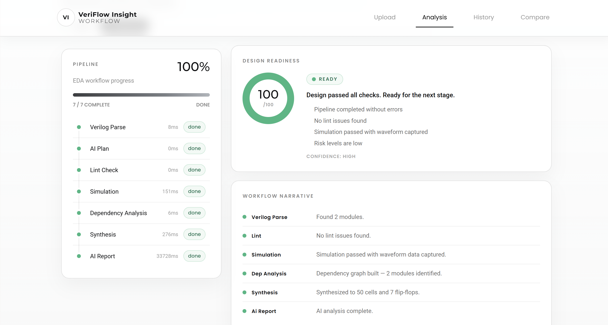
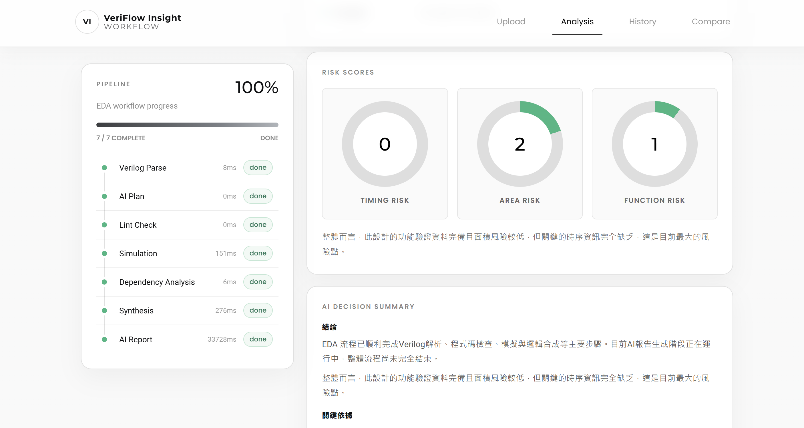
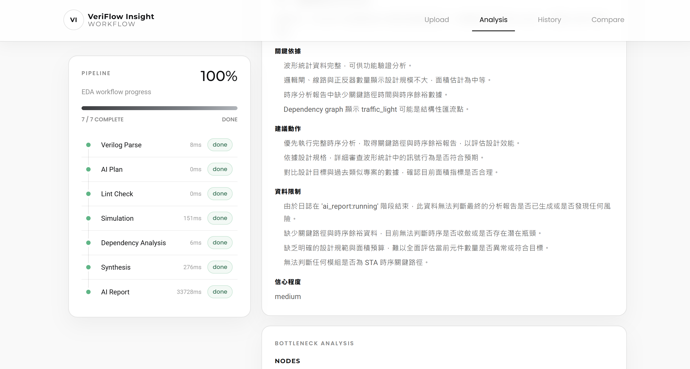
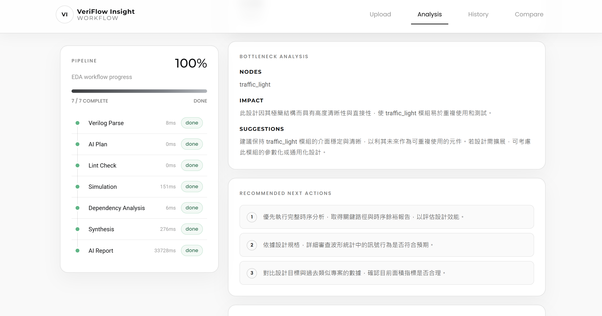
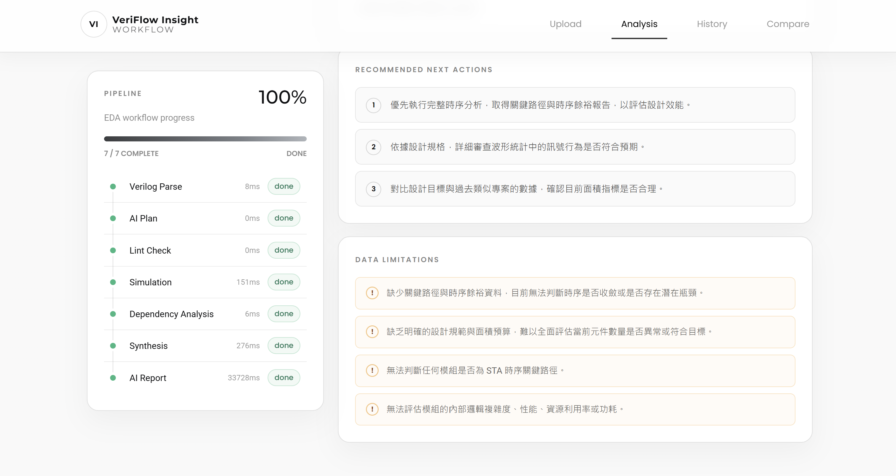

展示 AI summary、risk analysis 與建議修正方向。

### 7. Log viewer

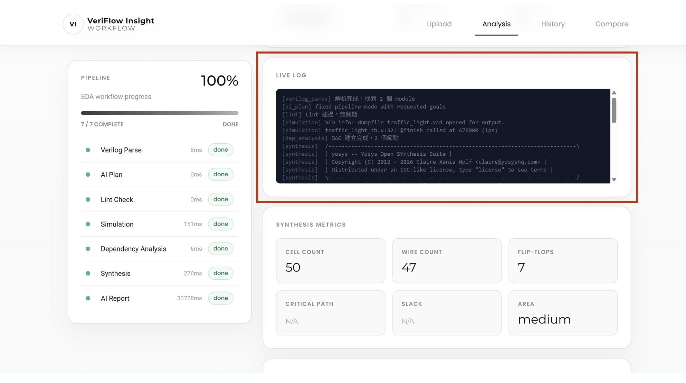

展示原始 EDA tool log，方便追蹤錯誤與警告。
