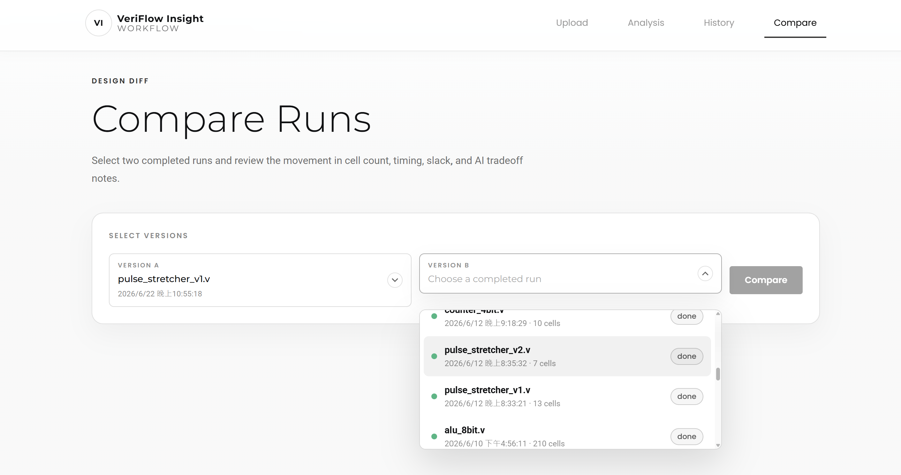
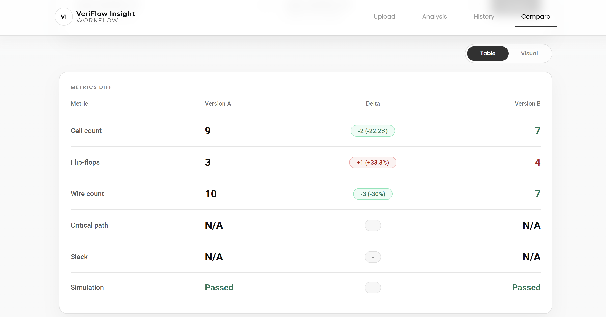
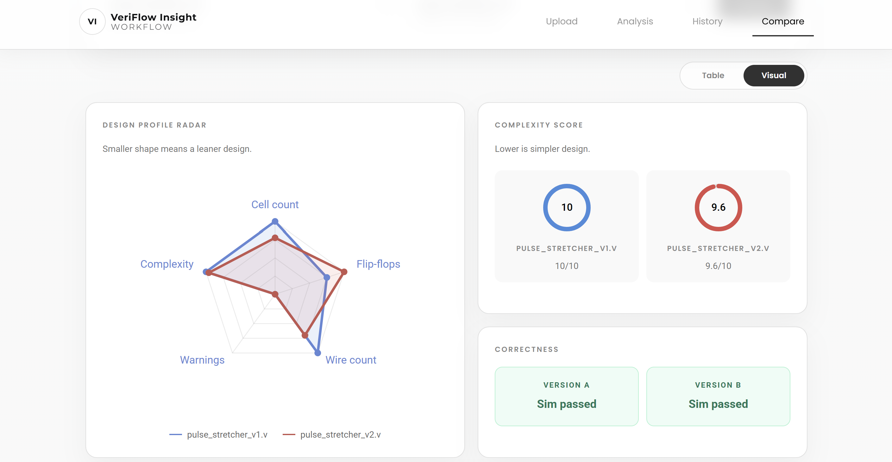
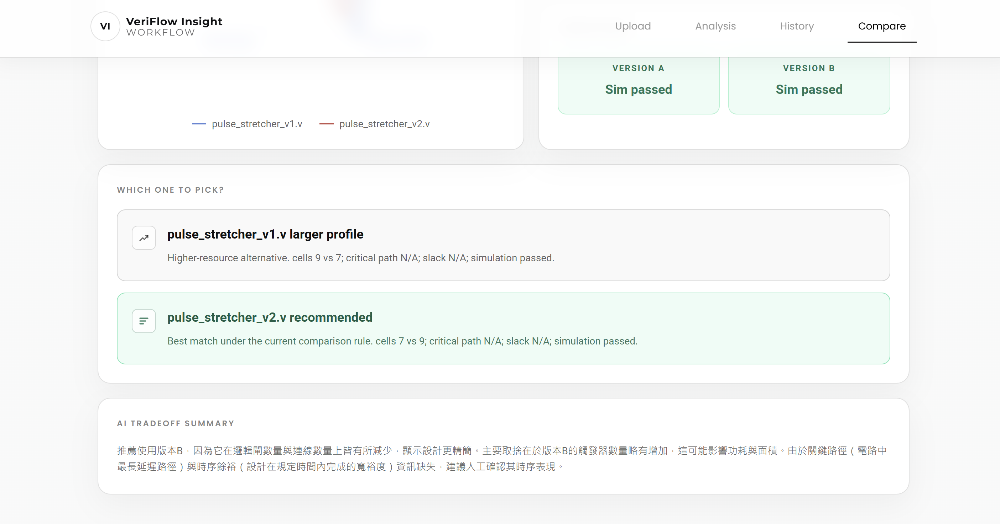

# Compare Page

此頁面用來比較兩次 Verilog 分析結果，協助判斷不同版本在面積、時序、警告與功能驗證上的差異。

## 操作步驟

1. 從 History 頁面勾選兩筆 run，點擊 `Compare selected`。
2. 查看兩個版本的基本資訊與 comparison verdict。
3. 在表格視圖中比較 cell count、wire count、flip-flop、critical path 與 slack。
4. 切換到視覺化視圖，查看雷達圖、complexity score 與 correctness 結果。
5. 閱讀 AI tradeoff analysis，整理 demo 中要說明的版本取捨。

## 功能介紹

- 比較兩筆 run 的 synthesis 與 simulation 指標。
- 顯示 delta、百分比差異與較佳方向。
- 提供 table view 與 visual view。
- 以雷達圖與 complexity gauge 輔助展示設計差異。
- 產生 AI 建議，說明哪個版本較適合目前目標。

## Demo 截圖順序

### 1. Compare 總覽

展示兩個版本的檔名、狀態與推薦結論。

### 2. 指標表格

比較 cell、wire、flip-flop、critical path 與 slack 的差異，方便說明哪個版本較佳。

### 3. 視覺化比較

使用 radar chart 與 complexity gauge 說明兩版設計輪廓。

### 4. AI tradeoff analysis

展示 AI 對資源、時序與功能風險的取捨建議。
