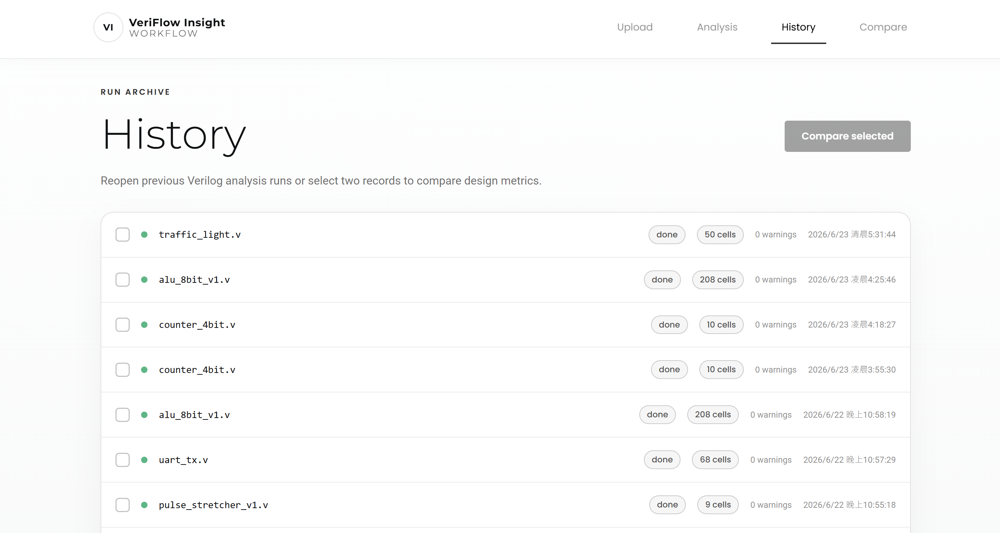
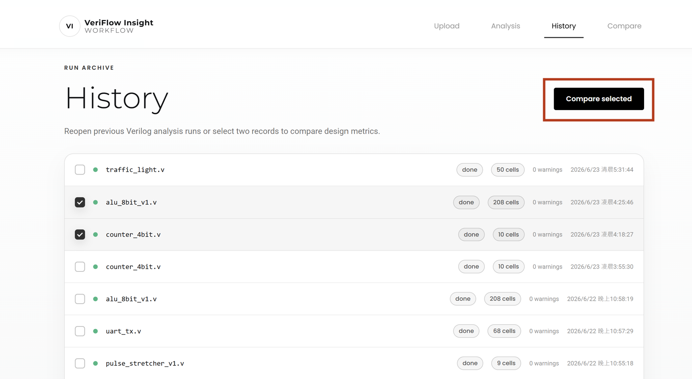

# History Page

此頁面用來瀏覽過去的分析紀錄，並可重新打開單次分析或選擇兩筆結果進行比較。

## 操作步驟

1. 開啟 History 頁面後，系統會載入所有分析紀錄。
2. 點擊檔名可進入該 run 的 Analysis 頁面。
3. 勾選兩筆紀錄後，點擊 `Compare selected` 進入 Compare 頁面。
4. 透過狀態、cell count、warning count 與建立時間快速判斷紀錄差異。

## 功能介紹

- 顯示每筆分析 run 的檔名、狀態、cell 數量、warning 數量與建立時間。
- 支援快速回到指定分析結果。
- 支援選擇兩筆紀錄進行版本比較。
- 空資料時提供回到 Upload 頁面的入口。

## Demo 截圖順序

### 1. 歷史紀錄列表

顯示過去分析紀錄與每筆 run 的摘要資訊。

### 2. 選取兩筆紀錄

勾選兩筆 run 後即可啟用比較功能。
