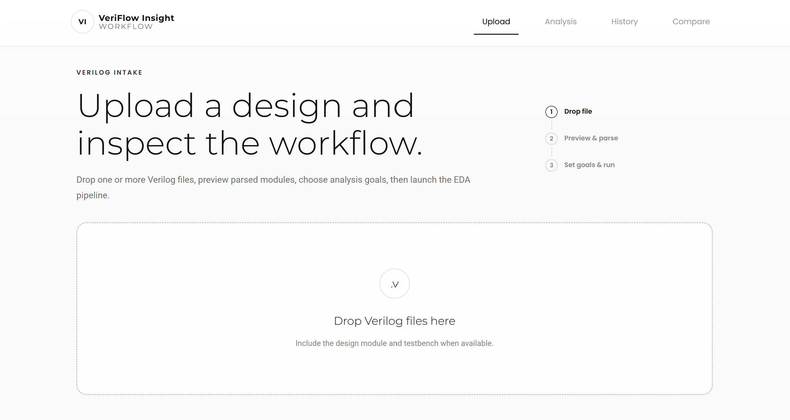
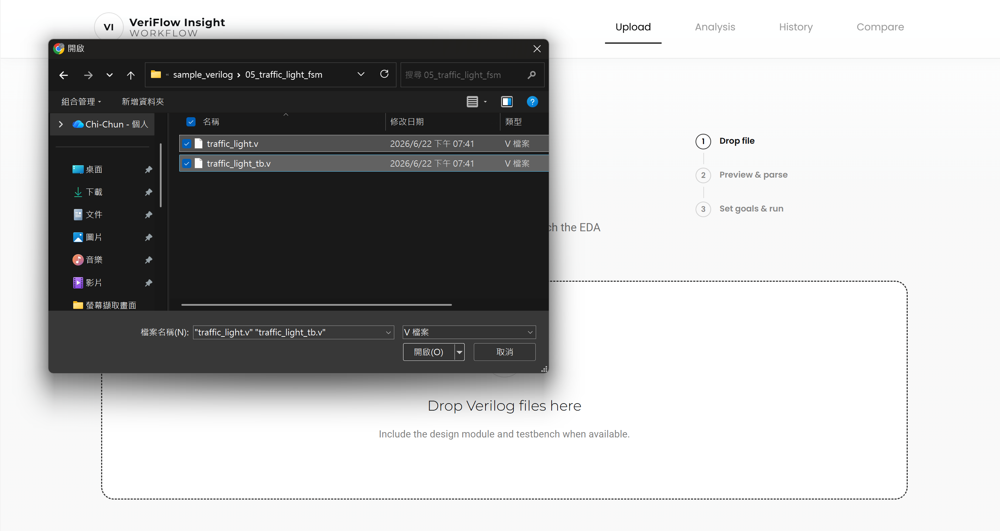
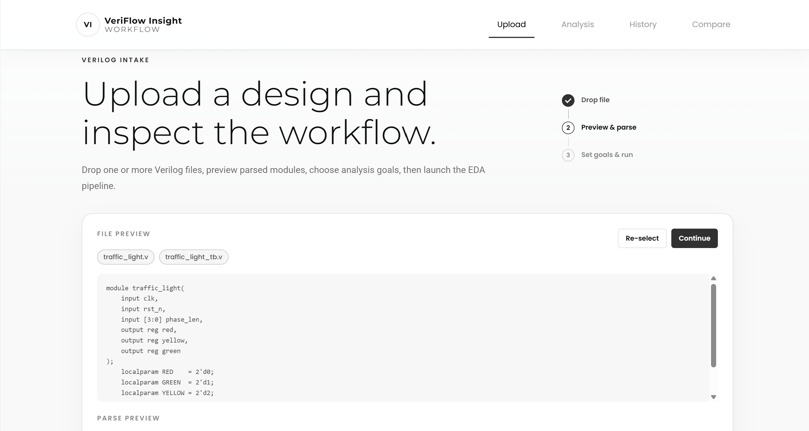
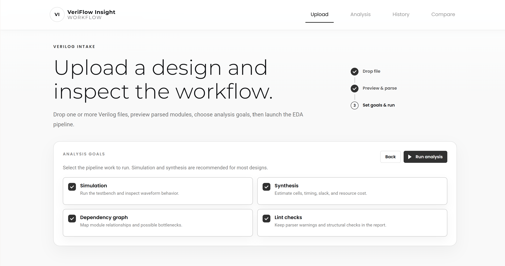

# Upload Page

此頁面用來上傳 Verilog 設計檔，並在開始分析前確認解析結果與分析目標。

## 操作步驟

1. 將一個或多個 `.v` 檔拖曳到上傳區，或點擊上傳區選擇檔案。
2. 在預覽畫面確認檔案內容、module、port 與 lint 初步結果。
3. 選擇本次要執行的分析目標，例如 simulation、synthesis、dependency graph、lint。
4. 點擊開始分析後，系統會建立 run 並跳轉到 Analysis 頁面。

## 功能介紹

- 支援多個 Verilog 檔案上傳。
- 自動預覽檔案內容與 parser result。
- 可在執行前重新選檔。
- 可選擇分析項目，控制本次 EDA workflow 要執行的範圍。

## Demo 截圖順序

### 1. 拖曳上傳區

使用者可拖曳或點擊上傳 `.v` 檔案。

### 2. 檔案預覽與 parser result

上傳後顯示 Verilog 內容預覽、module 與 port 資訊。

### 3. 分析目標選擇

執行前可勾選 simulation、synthesis、dependency graph 與 lint。
